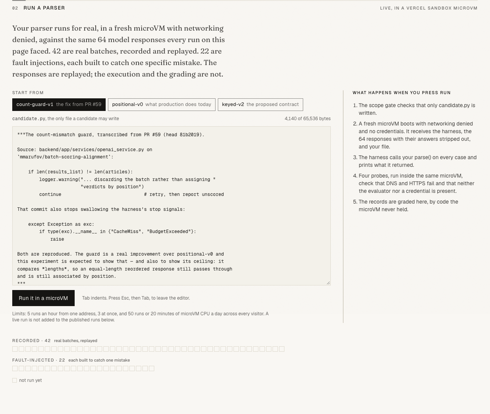
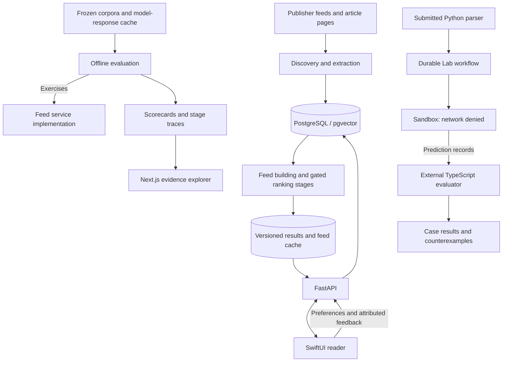

# Daily

A personalized iOS news reader with reproducible ranking evaluations and a sandboxed lab for testing the code that interprets model responses.

[](https://github.com/mmarufov/Daily/actions/workflows/backend-tests.yml)
[](https://github.com/mmarufov/Daily/actions/workflows/evidence-artifacts.yml)
[](LICENSE)

**[Open the Lab](https://marufov.com/lab)** · **[Explore the evidence](https://marufov.com/evidence)** · **[Replay an edition](https://marufov.com/reader)**

[](https://marufov.com/lab)

*The web Lab runs submitted parsers against frozen model responses. The reader demo replays a dated edition; the native iOS app connects to the news backend.*

## What it does

Daily turns conversational onboarding into a reader profile, discovers relevant sources, and assembles a personal news edition. Readers can search, save stories, and propose preference changes through Tune before applying them. The engineering problem is knowing whether personalization improved, where a relevant story disappeared, and whether a model's verdict was attached to the right article.

The repository connects the product to the tools used to investigate those questions: a SwiftUI app, a Python/FastAPI and PostgreSQL backend, an offline evaluation harness, and a Next.js evidence explorer and Lab.

## Engineering highlights

- **Replay the real feed implementation.** The evaluation runner substitutes frozen article data, time, and cached model responses while exercising the feed service. Ten reader fixtures across three snapshots make changes comparable; traces attribute missed stories to individual pipeline stages. [Runner](backend/evals/runners.py) · [Metrics](backend/evals/metrics.py)
- **Test the measurement system itself.** Nine fault variants exercise ranking, article/verdict association, labels, and assembly. The gate counts raised offline cache misses even when application fallback catches them, preventing a changed request from passing as a valid replay. [Fault matrix](backend/evals/degrade.py) · [Regression tests](backend/tests/test_eval_degradation.py)
- **Separate candidate execution from evaluation.** Lab submissions run in Vercel Sandbox with networking denied. The TypeScript evaluator stays outside the Python environment; versioned criteria grade returned records and report concrete counterexamples. Durable workflows record execution and avoid automatically retrying a potentially billable sandbox step. [Sandbox](web/lib/lab/sandbox.ts) · [Evaluator](web/lib/lab/evaluator.ts) · [Workflow](web/lib/lab/orchestration.ts)
- **Reject stale work at publication.** PostgreSQL extraction jobs use leases and claim versions. The gated ranking path additionally checks reader identity, recipe, revision, and expiry before publishing a monotonically sequenced result. [Content jobs](backend/app/services/article_content.py) · [Ranking repository](backend/app/services/ranking_repository.py)
- **Carry authority through to the device.** Feed requests are coalesced and fenced by operation and account identity. Account-scoped storage rejects older editions and revoked article bodies; the reader displays fetched native text only after storage accepts it. [Feed coordinator](Daily/Features/News/ViewModels/NewsViewModel.swift) · [Cache](Daily/Services/BackgroundNewsFetcher.swift) · [Lifecycle tests](DailyTests/DeliveryReaderLifecycleTests.swift)

## Architecture



`GET /feed` reads cached editions; explicit builds and background workers perform ingestion and scoring. New retrieval, ranking, and assembly stages have independent activation gates, so their presence in the repository does not imply every feed request uses them.

The web reader and evidence explorer consume exported artifacts. Lab execution is separate from the news backend: it tests parser behavior, and an accepted candidate is eligible for review rather than automatically deployed.

## Key engineering decisions

### 1. Freeze inputs before comparing ranking changes

News, model responses, and reader state all change independently. A before/after feed comparison is difficult to interpret unless those inputs are controlled.

Daily stores content-hashed snapshots and request-keyed model responses, then runs the feed implementation against a snapshot database adapter. Stage traces distinguish retrieval losses from scoring and assembly losses. Fault injection checks whether the metrics respond to known defects.

This makes regressions reproducible without provider calls. The tradeoff is explicit: a changed prompt needs a new recording, and frozen, provisionally labeled fixtures measure behavior on that corpus rather than live reader satisfaction. [Evaluation methodology](backend/evals/README.md)

### 2. Treat model output as an untrusted association problem

A JSON response can parse successfully while assigning the right verdict to the wrong article. Checking the output count alone cannot detect a reordered batch.

The Lab compares positional, count-guarded, and ID-keyed parsers against recorded responses and injected faults. The keyed contract requires the exact article ID set and rejects missing, duplicate, unknown, or invalid entries. The ranking service uses the same exact-set principle and additionally validates evidence hashes.

```python
# backend/app/services/ranking_contract.py
ids = [v.article_id for v in values]
if len(ids) != len(set(ids)) or set(ids) != set(packs):
    raise ValueError('ranker must return exact article ID set')
```

Refusing ambiguous output can reduce the number of usable results. That is a deliberate tradeoff: a missing judgment is observable; a plausible judgment attached to the wrong story can silently corrupt ranking. The experiment tests association correctness, not whether the model's relevance judgment is good. [Parser](backend/lab/contract/versions/keyed_v2.py) · [Ranking contract](backend/app/services/ranking_contract.py)

### 3. Recheck authority when work completes

An article can change, a reader can edit preferences, or a worker can lose its lease while an external request is in flight.

Database claims establish who may perform work; transactional completion checks establish whether its result is still publishable. The gated ranker reserves budget before provider calls and retains reservations after ambiguous failures. On iOS, operation and session checks prevent a late response from replacing a newer edition or crossing an account boundary.

These checks protect authoritative state without promising exactly-once provider execution. A crash after a provider call can still require a retry, and conservative reservations can reduce the remaining budget. [Publication checks](backend/app/services/ranking_service.py) · [Reservation logic](backend/app/services/ranking_repository.py)

## Correctness and reliability

Article evidence and display permission are separate. Native publisher text requires a complete, versioned artifact and an explicit source policy; otherwise the reader opens the original source. Policy changes invalidate relevant work and cached bodies. [Presentation contract](backend/app/services/article_content.py)

Feed and article fetching through `safe_http` validates DNS results, connects to the validated address, rechecks redirects, and bounds response sizes. Tests cover private addresses, redirect behavior, and transport construction. [Fetcher](backend/app/services/safe_http.py) · [Tests](backend/tests/test_safe_http.py)

The public Lab checks shared admission limits before allocating a sandbox and refuses execution when its accounting store is unavailable. Completed sandbox executions run isolation probes; the evaluator never treats a missing result as acceptance. [Admission control](web/lib/lab/public-run.ts) · [Limits](web/lib/lab/public-limits.ts)

## Evaluation evidence

The committed [fault matrix](backend/evals/results/degradation-matrix.json) records an offline run at revision `9cf217e` on September 30, 2026:

| Check | Recorded result |
|---|---|
| Evaluation inputs | 10 reader fixtures; 3 snapshots containing 1,328 / 1,234 / 1,358 articles |
| Fault coverage | 6 targeted faults met their declared checks; 3 blind-spot or invariance predictions held |
| Rotate verdicts onto the wrong articles | Pooled judge precision fell from 0.6405 to 0.3278 across 24 defined reader/snapshot pairs |
| Provider spend during replay | $0; responses came from the committed cache |

The rotation experiment demonstrates sensitivity to an association defect, not an improvement in recommendation quality. The matrix also records measurement boundaries, including insensitivity to ordering within the top 12. CI checks regression against recorded baselines; absolute quality targets are a separate opt-in gate.

The Lab's separate parser suite contains **42 recorded batches and 22 synthetic fault cases**. Its [versioned experiment specification](web/lib/lab/spec.ts) preserves which criteria each result was judged against. Results from different specifications are not interchangeable.

## Quick start

**Explore without setup:** open the [Lab](https://marufov.com/lab), [evidence explorer](https://marufov.com/evidence), or [frozen reader demo](https://marufov.com/reader).

**Run the iOS app:** use Xcode 26+ and an iOS 26 simulator.

```bash
git clone https://github.com/mmarufov/Daily.git
cd Daily
open Daily.xcodeproj
```

Select the `Daily` scheme, resolve package dependencies, and run. [AppConfig.swift](Daily/AppConfig.swift) defaults to the hosted backend. A physical device requires your signing team. For a separate deployment, configure the backend URL and keep the Google OAuth client, callback URL scheme, and backend audience in agreement.

**Run the offline evaluation:** from the repository root, with Python 3.12:

```bash
cd backend
python3.12 -m venv .venv
source .venv/bin/activate
python -m pip install -r requirements.txt -r requirements-dev.txt
EVAL_OFFLINE=1 python -m pytest tests/test_eval_degradation.py -q
```

This replays the fault matrix and checks it against the committed result. It needs no provider key or database. Backend deployment configuration is in [fly.toml](backend/fly.toml) and [.env.example](backend/.env.example); web configuration and commands are in [web/README.md](web/README.md).

## Testing

- **Backend contracts:** extraction policy, stale leases, ranking publication, budget admission, delivery receipts, and adversarial assembly cases. [Tests](backend/tests/)
- **Database transactions:** CI provisions PostgreSQL 16 with pgvector 0.8.0 and rejects missing or skipped tests in required database suites. [Workflow](.github/workflows/backend-tests.yml)
- **iOS lifecycle:** stale responses, account changes, monotonic cache writes, revocation, and reader recovery. Run the `Daily` test action in Xcode. [Tests](DailyTests/)
- **Web and Lab:** evaluator rejection cases, parser scope, run recovery, shared limits, artifact provenance, and export determinism. [Tests](web/tests/)

Web checks, from the repository root with Node.js 24:

```bash
cd web
npm ci
npm run typecheck
npm test
npm run export:artifacts -- --check
npm run export:lab -- --check
```

Artifact validation runs without publishing credentials. A separate [publication workflow](.github/workflows/evidence-publish.yml) checks successful default-branch provenance before writing to Vercel Blob.

## Repository map

| Path | Responsibility |
|---|---|
| [Daily/](Daily/) | SwiftUI app, delivery coordination, reader state, local storage |
| [backend/app/](backend/app/) | FastAPI routes, PostgreSQL repositories, ingestion and ranking |
| [backend/evals/](backend/evals/) | Frozen snapshots, response cache, metrics, fault injection |
| [backend/lab/](backend/lab/) | Parser contracts, recorded cases, candidate evidence |
| [web/](web/) | Next.js reader replay, evidence explorer, sandbox orchestration |
| [docs/stages/](docs/stages/) | Stage-specific designs, contracts, and activation records |

## License

[GNU Affero General Public License v3.0](LICENSE). Copyright 2026 Muhammadjon Marufov.
