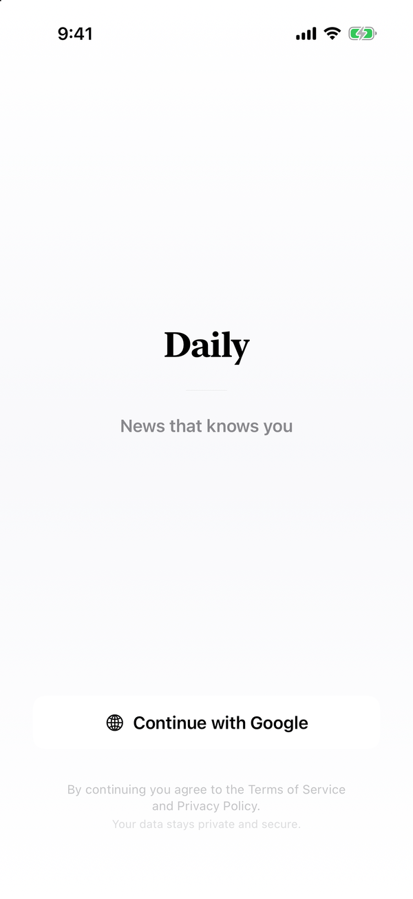
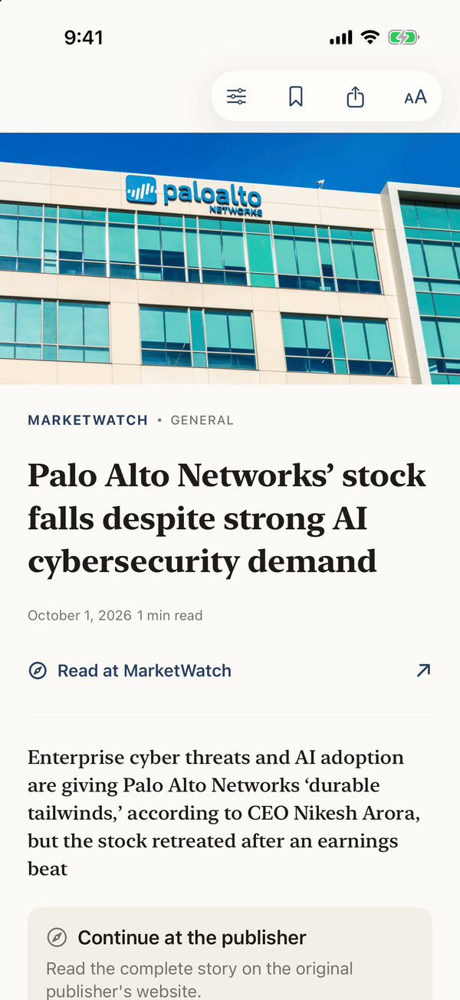
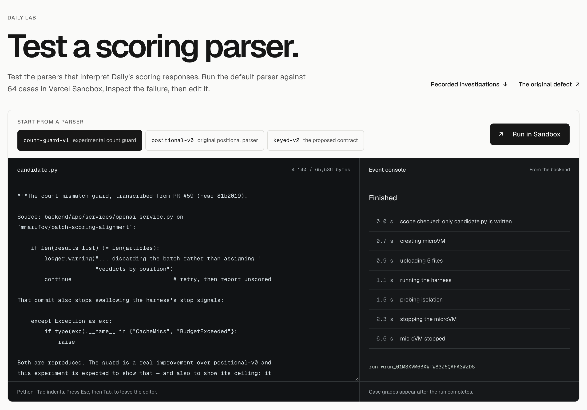
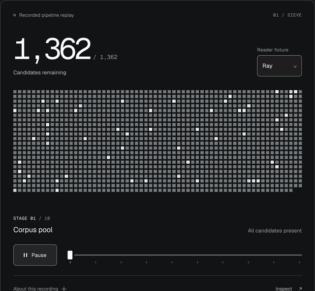

<div align="center">


# Daily

**News that knows you.**

A native iOS news app built on a ten-stage LLM pipeline,<br>
measured by offline replay and tested in a public sandbox.

[**Open Daily Lab**](https://marufov.com/lab) · [Evaluation evidence](https://marufov.com/evidence) · [Recorded editions](https://marufov.com/reader) · [Architecture](#architecture) · [Docs](docs/README.md)

[](https://github.com/mmarufov/Daily/actions/workflows/backend-tests.yml)
[](https://github.com/mmarufov/Daily/actions/workflows/evidence-artifacts.yml)
[](LICENSE)

</div>

<p align="center">
  <picture>
    <source media="(prefers-color-scheme: dark)" srcset="docs/assets/ios-signin-dark.png">
    
  </picture>
  &nbsp;
  <picture>
    <source media="(prefers-color-scheme: dark)" srcset="docs/assets/ios-edition-dark.png">
    
  </picture>
  &nbsp;
  <picture>
    <source media="(prefers-color-scheme: dark)" srcset="docs/assets/ios-story-dark.png">
    
  </picture>
</p>

## What Daily is

Daily turns a short onboarding conversation into a reader profile, finds the sources that matter to that reader, and assembles a personal edition. Readers search, save stories, discuss any story with an assistant that cites its sources, and retune their profile in plain language through Tune, which proposes a change and applies it only when the reader confirms.

Behind the app is a FastAPI service on PostgreSQL and pgvector that runs the pipeline as ten stages, from source discovery to learning, each with its own contract and activation gate. An offline harness replays the production feed code against frozen corpora and recorded model responses, so every change is measured for $0 and every lost story is traced to the stage that dropped it. [Daily Lab](https://marufov.com/lab), a Next.js site on Vercel, lets anyone run code against the pipeline's verdict-to-article contract inside a Firecracker microVM.

The repository holds about 99,000 lines of first-party Python, TypeScript, Swift and SQL, built across more than 250 commits and 90 merged pull requests since November 2025.

## Highlights

- **Public sandboxed lab.** Visitors submit a Python parser and run it against 42 recorded model responses and 22 fault injections. Each run boots a fresh microVM in [Vercel Sandbox](web/lib/lab/sandbox.ts) with networking denied, and a [TypeScript evaluator](web/lib/lab/evaluator.ts) outside the VM grades it under a hash-pinned specification.
- **Pre-registered fault injection.** Nine faults and their expected effects were [pinned by SHA-256](backend/evals/degrade.py) before the matrix was recorded. All 6 targeted faults moved their declared metrics and all 3 blind-spot predictions held. Shifting each verdict onto its neighbor's article cuts judge precision from 0.6405 to 0.3278 (sign test p = 0.0001).
- **Offline replay at zero cost.** The production feed code runs unchanged against SHA-256-verified corpora and 2,169 recorded model responses. Replaying the whole fault matrix costs $0.00 instead of about $5.40 at API prices, and [CI fails on any cache miss](backend/evals/metrics.py), including one the application swallowed.
- **Agent benchmark.** 31 budgeted agent investigations by GPT-4.1, GPT-5 mini and Kimi K2 worked on the parser through the Vercel AI Gateway, for $0.78 in total. Their 8 proposals faced the same scope gate, microVM and evaluator as a human submission, and 2 were accepted for review.
- **Correctness under concurrency.** The server uses PostgreSQL leases with version tokens, compare-and-set publication and per-reader monotonic sequencing. The app fences feed and reader work by operation and account, so a late response cannot replace a newer edition or cross an account boundary.
- **Hardened fetching.** Every live fetch of an untrusted URL goes through [`safe_http`](backend/app/services/safe_http.py), which requires every DNS answer to be public, connects to the validated address, revalidates each redirect and caps the response at 2 MB.
- **Tested in depth.** More than 2,900 backend tests, 330 web unit tests, 90 Playwright tests in three browser projects and 150 iOS tests. CI provisions PostgreSQL 16 with pgvector 0.8.0 and fails when a required database suite is skipped.

## Daily Lab

Language models return relevance verdicts in batches, and a parser has to attach each verdict to the article it describes. [Daily Lab](https://marufov.com/lab) puts that contract in front of anyone with a browser: edit a parser, run it in a microVM, and see the exact case that breaks it.

<a href="https://marufov.com/lab">
  <picture>
    <source media="(prefers-color-scheme: dark)" srcset="docs/assets/lab-run-dark.png">
    
  </picture>
</a>

<p align="center"><sub>A completed run on marufov.com/lab. The event console streams each stage as the backend reports it.</sub></p>

1. **Scope gate.** The submission may write exactly one file, `candidate.py`, up to 64 KB.
2. **Fresh microVM.** Vercel Sandbox boots a Firecracker microVM (Python 3.13, 2 vCPUs, 120 s limit) under a platform-applied `deny-all` network policy. It receives the harness, the 64 cases with their answers removed, and the candidate.
3. **Harness.** `parse()` runs on every case. Prediction records leave the VM inside a random-UUID frame, and the record schema has no field for a grade.
4. **Isolation probes.** Four probes run in the same microVM after the candidate: DNS must fail, HTTPS must fail, no evaluator code may exist on disk, and no credential may exist in the environment. All 36 probes in the published runs held.
5. **Independent grading.** The evaluator grades the records outside the VM against six criteria, each with a threshold of 1.0, and names the first misattributed article in reading order. Every run is graded under both generations of the specification.

<picture>
  <source media="(prefers-color-scheme: dark)" srcset="docs/assets/lab-verdict-dark.png">
  
</picture>

| Candidate | Verdict |
|---|---|
| `keyed-v2`, the ID-keyed contract | **Accepted for review**: 60 of 60 applicable cases, and the same association under all 720 orderings of a batch |
| `count-guard-v1`, a count-mismatch guard | Rejected at 48 of 52: an equal-length reordered response passes a count check |
| `positional-v0`, positional association | Rejected at 0 of 52 |
| `keyed-fallback-v1`, keyed with a positional fallback | 60 of 60, then rejected by generation 2's `protocol-exclusivity` criterion |
| Three seeded controls, defective by design | Rejected, each by the criterion its defect violates |
| 31 agent investigations | 8 proposals reached a microVM, 2 accepted for review |

The public runner admits each run through one atomic Redis transaction against four shared limits, and refunds every refusal. Orchestration is a durable [Vercel Workflow](web/lib/lab/orchestration.ts) whose sandbox step is never retried, so a failure costs one microVM. The [Lab README](web/README.md) covers the specification, the isolation boundary, admission control and the agent benchmark in full.

## Evaluation

<p align="center">
  
</p>

<p align="center"><sub>A recorded replay for one reader: 1,362 candidate articles narrow to a 50-story edition across ten stages. One cell per article.</sub></p>

The harness answers two questions about any change: did the edition get better or worse, and which stage lost a story the reader needed? [`ProductionRunner`](backend/evals/runners.py) calls the production feed service itself. It replaces only the database, with an in-memory connection that serves production SQL from a frozen snapshot and raises on any query it does not recognize, and it routes model calls through a cache keyed by the SHA-256 of each request. Every article carries a stage trace, so a missed story is attributed to the stage that dropped it.

| Input | |
|---|---|
| Corpora | 3 content-hashed snapshots of 1,328, 1,234 and 1,358 articles from about 50 sources |
| Reader fixtures | 10, each built to stress one axis: cold start, exclusions, transliterated entities, follow-ups, hyper-local news |
| Ground truth | 10,431 relevance grades from a two-pass model grader (gpt-4.1-mini, then gpt-4.1 on contested cases) and an agent editorial pass, plus 19 planted must-see articles and 19 lookalikes per snapshot |
| Model responses | 2,169, recorded and keyed by request hash |

The fault matrix below was committed at `9cf217e` on 2026-09-30, one hour after its declarations were pinned. A fresh replay at HEAD matches it, and CI replays it on every pull request.

| Fault injected into the replay | Declared effect | Recorded, pooled across readers |
|---|---|---|
| Each verdict shifts onto its neighbor's article | Judge precision falls | 0.6405 to 0.3278, 17 of 24 pairs worse |
| The ranked feed is reversed | Needle recall falls | 0.6333 to 0.2833 |
| The scorer marks every article relevant | Judge precision falls | 0.6405 to 0.1160 |
| Each reader is graded against another reader's labels | Needle recall falls | 0.6333 to 0.0000 |
| Prototype: verdict bodies shift while their IDs stay | Judge precision falls | 0.8483 to 0.2470, 27 of 28 pairs worse |
| Prototype: forced world-critical slots are ignored | Event delivery falls | 0.775 to 0.375 |
| No diversity pass, top 12 reversed, ID-keyed list rotated | No metric moves | Largest change 0.0167 |

A tenth control changes the scorer's requests upstream. It makes no network call and raises 90 cache misses that the application catches and hides; the gate counts them and fails the run. [Matrix](backend/evals/results/degradation-matrix.json) · [Methodology](backend/evals/README.md) · [Gate tests](backend/tests/test_eval_degradation.py)

## Architecture

<picture>
  <source media="(prefers-color-scheme: dark)" srcset="docs/assets/architecture-dark.png">
  
</picture>

| Stage | Responsibility | Mechanism |
|---|---|---|
| S1 Sources | 38 global feeds and per-reader discovery from an 82-source seed registry | SSRF-resistant fetching, sources validated by a live fetch |
| S2 Content | Article extraction into versioned artifacts | `FOR UPDATE SKIP LOCKED` leases with version compare-and-set; native text only under an explicit source policy |
| S3 Understanding | Entities, topics and structured meaning | Transactional outbox and inbox between stages |
| S4 Events | Clustering stories into events and assessing their gravity | Six-dimension assessment into world-critical, major and routine tiers |
| S5 Reader model | The durable profile behind onboarding and Tune | Optimistic concurrency on generation and revision, idempotent operations |
| S6 Retrieval | Candidates for the ranker | Reciprocal rank fusion (k = 60) over lexical, dense pgvector and identity legs |
| S7 Ranking | LLM judgments against the reader | Exact-ID contract, verbatim evidence quotes, budget reserved before every provider call |
| S8 Assembly | Turning a ranking into an edition | Deterministic fairness and diversity constraints, a recorded disposition for every candidate |
| S9 Delivery | Versioned editions to the app | Monotonic per-reader sequence, delivery receipts |
| S10 Learning | Folding reading behavior back into the profile | One shared reward definition, attributed feedback |

| Layer | Stack |
|---|---|
| iOS app | Swift, SwiftUI, Swift concurrency with main-actor default isolation, iOS 26, Google Sign-In, Keychain |
| API and workers | Python 3.12, FastAPI, six background loops with leader election through PostgreSQL advisory locks, Fly.io |
| Data | PostgreSQL and pgvector: 80 tables, 86 CHECK constraints, 1,536-dimension embeddings behind an HNSW index |
| Models | OpenAI gpt-4.1-mini, gpt-4o-mini and text-embedding-3-small |
| Web and Lab | Next.js 16, React 19, strict TypeScript, Tailwind CSS 4 |
| Lab infrastructure | Vercel Sandbox, Vercel Workflow, Vercel Blob, Vercel AI Gateway, Upstash Redis |

## Design decisions

**Verdicts are keyed by article ID and checked as an exact set.** A response can parse cleanly and still attach the right verdict to the wrong article, and a count check cannot see an equal-length reorder. The ranking contract requires the exact set of requested IDs, a matching evidence hash for each, and a verbatim quote from the frozen evidence for every positive grade.

```python
# backend/app/services/ranking_contract.py
ids = [v.article_id for v in values]
if len(ids) != len(set(ids)) or set(ids) != set(packs):
    raise ValueError('ranker must return exact article ID set')
```

**Every measurement runs on frozen inputs.** News, model responses and reader state change independently, so a before-and-after comparison holds all three still. Snapshots are content-hashed, responses are keyed by request hash, and a changed prompt is a new recording. Any regression reproduces on a laptop with no provider key.

**Authority is rechecked at publication.** An article can change, a reader can edit their profile, or a worker can lose its lease while a model call is in flight. Database claims decide who may do work, and a transactional compare-and-set at completion decides whether the result may still publish. Budget is reserved under a single control-row lock before each provider call, against global and per-account daily caps.

**Untrusted code never shares a boundary with a secret.** Lab candidates run in a different process, language and machine from their grader, with no credential in reach. CI follows the same rule: the workflow holding the Blob publishing token runs only after a successful push to `main`, checks that the commit is an ancestor of `origin/main`, re-validates every artifact it downloads, and uploads the manifest last.

## Getting started

**Without setup.** Run a parser in [Daily Lab](https://marufov.com/lab), compare runs in the [evidence explorer](https://marufov.com/evidence), or read a [recorded edition](https://marufov.com/reader).

**iOS app.** Xcode 26 or later and an iOS 26 simulator.

```bash
git clone https://github.com/mmarufov/Daily.git && cd Daily
open Daily.xcodeproj
```

Run the `Daily` scheme. [AppConfig.swift](Daily/AppConfig.swift) points at the hosted backend, and the `DAILY_BACKEND_URL` Info.plist key overrides it. A device build needs your signing team.

**Evaluation and Lab contract.** Python 3.12, with no provider key and no database.

```bash
cd backend
python3.12 -m venv .venv && source .venv/bin/activate
pip install -r requirements.txt -r requirements-dev.txt

# Replay the pre-registered fault matrix: 31 passed
EVAL_OFFLINE=1 python -m pytest tests/test_eval_degradation.py -q

# The Lab contract, including all 720 orderings of a batch: 741 passed
python -m pytest tests/test_lab_contract.py -q
```

**Web and Lab.** Node.js 24.

```bash
cd web
npm ci
npm run dev          # http://localhost:3000
```

Backend deployment settings live in [fly.toml](backend/fly.toml) and [.env.example](backend/.env.example). Web configuration and every command are in the [web README](web/README.md).

## Testing

| Suite | Tests | Runs in |
|---|---|---|
| Backend, pytest | 2,900+, including an exhaustive 720-ordering permutation suite | CI on every pull request, offline; 180 database tests against PostgreSQL 16 and pgvector 0.8.0 |
| Web unit, Vitest | 330+ | CI |
| Web end-to-end, Playwright | 90+ tests in 3 projects: desktop Chrome, Pixel 7, iPhone 14 WebKit | Against marufov.com, with every Lab API call intercepted |
| iOS, XCTest | 150 | Xcode, `Daily` test action |

- **Backend** covers extraction policy, stale leases, ranking publication, budget admission, delivery receipts, adversarial edition assembly and concurrent claims against real PostgreSQL.
- **iOS** covers late responses, account switches, monotonic cache writes, body revocation, offline grants and reader recovery.
- **Web** covers evaluator rejection cases, patch scope, run recovery, shared limits, artifact provenance, byte-for-byte export determinism, touch targets, forced-colors mode and reduced motion.

## Repository layout

| Path | Contents |
|---|---|
| [Daily/](Daily/) | SwiftUI app: edition, reader, Tune, search, saved stories, account-scoped storage |
| [DailyTests/](DailyTests/) | XCTest suites for delivery, storage, auth and the reader |
| [backend/app/](backend/app/) | FastAPI routes, the ten pipeline stages, PostgreSQL schema and repositories |
| [backend/evals/](backend/evals/) | Frozen corpora, response cache, metrics, fault registry and results |
| [backend/lab/](backend/lab/) | Parser contract, recorded and synthetic cases, candidates and controls |
| [web/](web/) | Next.js site: Daily Lab, evidence explorer and recorded editions |
| [docs/](docs/) | Stage audits, plans and status records, architecture, design system |
| [.github/workflows/](.github/workflows/) | Backend tests and evaluation gate, artifact validation, trusted publication |

Every pipeline stage has a written audit, and S3 through S10 add an implementation plan and a status record: 27 documents and about 71,000 words in [docs/stages](docs/stages/), indexed in [docs/README.md](docs/README.md).

## License

[GNU Affero General Public License v3.0](LICENSE). Copyright 2026 Muhammadjon Marufov.
