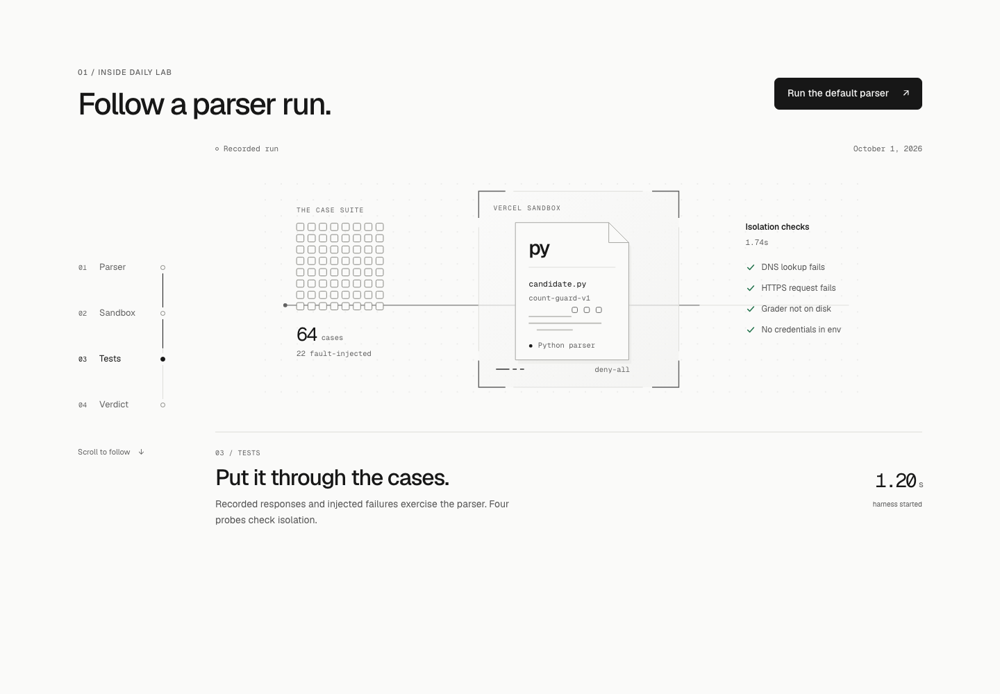
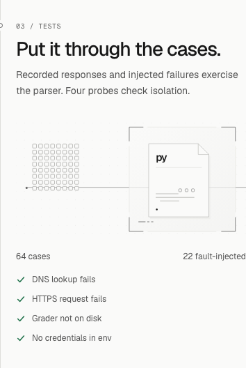

# Homepage run story verification

Preview application revision: `37c0e1be`, based on main `97b31eb2`.
[PR #102](https://github.com/mmarufov/Daily/pull/102) uses branch
`mmarufov/homepage-flow`. Production remains unchanged.

[Verified HTTPS preview](https://daily-83q2jot9u-mmarufovs-projects.vercel.app)
uses deployment `dpl_2ueNbVtfjZKs4pV7jseDSNrcwGBn`. Vercel account access is required.

The homepage keeps the Daily introduction and recorded edition. Four stages
follow a parser into a Sandbox, through tests and into external grading. The
historical guard comparison is shorter, with the pipeline and retrieval charts
available through their existing Evidence links. Supporting pages, fonts, shared
styles, backend, runner and artifacts retain their previous behavior.

Timeline and verdict both use saved run
`wrun_01M3WXWPKMF3H8Q66KZA56MZCV`: 64 cases, 22 fault-injected, 48 correct,
4 failed and 12 not applicable. The page makes no execution requests.

Validation:

- Typecheck, 332 unit tests, artifact validation/staleness checks and production
  build passed. One existing unit test remains skipped.
- Chromium desktop/mobile and WebKit: the full suite on `9b8e5706` passed 271
  checks with two existing touch-keyboard skips. Three checks found the same
  720px-height caption overflow. After fixing it, all 57 homepage checks passed
  on `37c0e1be`. Other routes were unchanged by that spacing/SVG correction.
- Browser checks cover forward/reverse/rapid scrolling, milestone keyboard
  navigation, hidden tabs, idle/offscreen work, no JavaScript, reduced motion,
  forced colors, exact counts, Reader-only font loading and mocked Lab states.
  The unavailable recording is covered by an SSR unit test. No Sandbox
  submission was made.
- Light/dark screenshots at 320, 390, 768, 1024, 1440 and 1920px show no horizontal
  overflow. Every stage fits at 1024x720 and 1280x720. No page errors appeared.
- Mobile LCP: 1100 / 984 / 996ms; CLS: 0.000169 or less. Three fresh, cache-disabled
  Chromium Pixel 7 contexts at 412x839, 4x CPU slowdown, 1.6Mbps download, 750Kbps
  upload and 150ms latency on macOS. These are laboratory measurements.
- Desktop scroll profile at 1440x900 with 4x CPU slowdown: 241 sampled frames,
  median/p95 16.7ms, maximum 16.8ms, no long tasks. The scene made zero DOM updates
  during two-second idle and offscreen samples.

[Motion recording](homepage-run-story/motion.mp4).

The original Sydney workspace holds the remaining captures under
`.context/flow-after/`. Logs and measurements are `flow-unit.log`,
`flow-artifacts.log`, `flow-build.log`, `flow-e2e-final.log`,
`flow-e2e-story-final.log`, `flow-layouts.json`, `flow-performance.json` and
`flow-scroll-profile.json`. The original dirty checkout was preserved.
