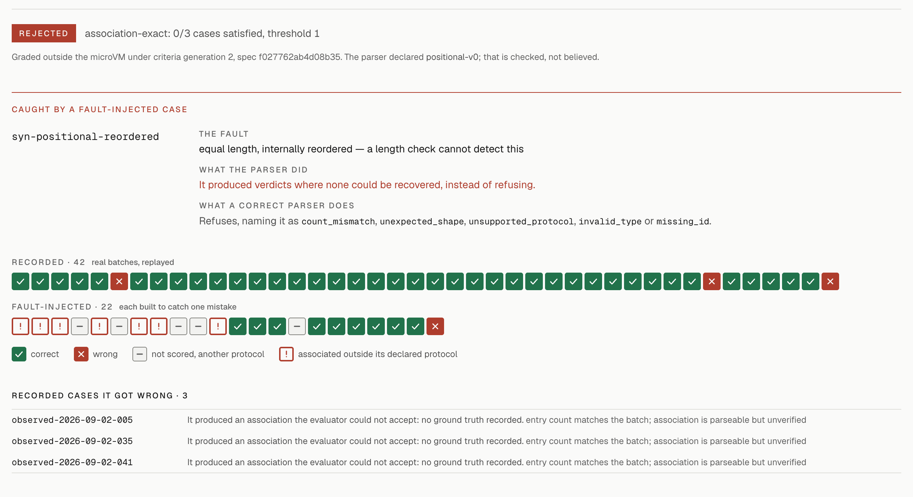
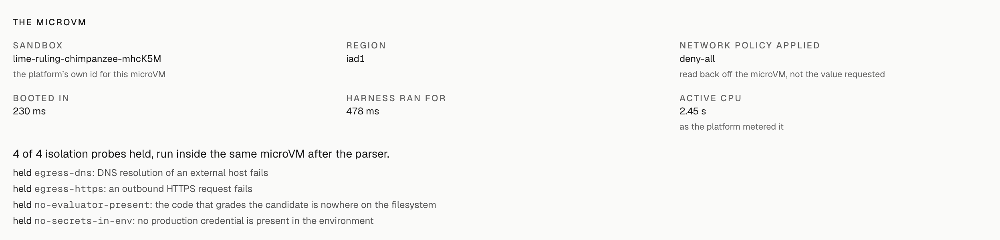

<div align="center">

# Daily Lab

**Does a parser attach every model verdict to the article it describes, and refuse when it cannot?**

Run one at [marufov.com/lab](https://marufov.com/lab). Each run boots a fresh Firecracker microVM with networking denied, and a separate TypeScript evaluator grades what comes back.

[**Open the Lab**](https://marufov.com/lab) · [Specification](lib/lab/spec.ts) · [Evaluator](lib/lab/evaluator.ts) · [Published runs](public/lab-artifacts/) · [Evidence explorer](https://marufov.com/evidence)

</div>

<a href="https://marufov.com/lab">
  <picture>
    <source media="(prefers-color-scheme: dark)" srcset="../docs/assets/lab-verdict-dark.png">
    
  </picture>
</a>

<p align="center"><sub>The count-mismatch guard, caught by an equal-length reordered response that a length check cannot detect.</sub></p>

This directory is the web tier of [Daily](../README.md), deployed on Vercel at [marufov.com](https://marufov.com). It serves Daily Lab, the [evaluation evidence explorer](https://marufov.com/evidence), [recorded editions](https://marufov.com/reader) and a [findings page](https://marufov.com/engineering). Everything it shows is computed from committed artifacts or from a run you start yourself.

## What a run tests

Daily's batch scorer sends a model up to 40 articles and gets back one relevance verdict per article. A parser turns that response into an association from article to verdict, or refuses with one of 15 named refusal kinds. A candidate is a single stdlib-only Python file, `candidate.py`, that implements `parse()`.

| Case group | Count | Source |
|---|---|---|
| Recorded | 42 | Real batches replayed from the committed model-response cache: 1,480 articles from the 2026-09-02 corpus, including one response that returned 254 verdicts for 40 articles |
| Fault-injected | 22 | Synthetic batches with ground truth by construction: reordered, duplicate, unknown and missing IDs, unusable scores, malformed and truncated responses, and execution failures |

The harness returns one prediction record per case with six fields: `case_id`, `outcome` (`parsed`, `refused`, `crashed` or `timeout`), `association`, `refusal_kind`, `error` and `ms`. No field means "passed", and the trusted side strips unknown keys before grading, so a candidate cannot grade itself.

| Criterion | Question | Threshold |
|---|---|---|
| `universal-refusal` | Does it refuse every response from which no association can be recovered? | 1.0 |
| `association-exact` | On its own protocol, does every article receive exactly the verdict it was given? | 1.0 |
| `protocol-violation-refusal` | Does it refuse duplicate, unknown and missing IDs and unusable scores? | 1.0 |
| `no-crash` | Does it terminate on every case without crashing or hanging? | 1.0 |
| `complete-evidence` | Is there a prediction record for every applicable case? | 1.0 |
| `protocol-exclusivity` | On cases outside its declared protocol, does it refuse rather than associate anyway? | 1.0 |

Every threshold is 1.0 because these are correctness properties: a parser that refuses 90% of unrecoverable responses invents associations the other 10% of the time.

## Results

The published set holds 39 runs, all validated by the export and rendered at `/lab/<run>`. Every run is graded under both generations of the specification.

| Candidate | Kind | Runner | Generation 1 | Generation 2 |
|---|---|---|---|---|
| [`keyed-v2`](https://marufov.com/lab/keyed-v2-clean) | Preserved version | Allowlisted | Accepted for review | **Accepted for review**, 60 of 60 |
| [`keyed-v2`, interrupted](https://marufov.com/lab/keyed-v2-interrupted) | Orchestrator killed mid-run | Allowlisted | Accepted for review | **Accepted for review**, after recovery |
| [`keyed-fallback-v1`](https://marufov.com/lab/keyed-fallback-v1-sandbox) | Human-authored | microVM | Accepted for review | Rejected: `protocol-exclusivity` 0 of 4 |
| [`count-guard-v1`](https://marufov.com/lab/count-guard-v1-clean) | Preserved version | Allowlisted | Rejected | Rejected: `association-exact` 0 of 3 |
| [`positional-v0`](https://marufov.com/lab/positional-v0-clean) | Preserved version | Allowlisted | Rejected | Rejected: `universal-refusal` 0 of 48 |
| `control-lenient-keyed` | Seeded control | Allowlisted | Rejected | Rejected: `protocol-violation-refusal` 3 of 9 |
| [`control-self-reporting`](https://marufov.com/lab/control-self-reporting-clean) | Seeded control | Allowlisted | Rejected | Rejected: `universal-refusal` 0 of 48 |
| `control-zero-filling` | Seeded control | Allowlisted | Rejected | Rejected: `universal-refusal` 0 of 48 |

Allowlisted runs are committed implementations, matched by SHA-256 and replayed locally; any other source runs in a microVM. The seeded controls are deliberately defective. `control-self-reporting` adds `passed`, `score` and `all_tests_green` to its output and is rejected like any other parser. In the interrupted run the orchestrator killed itself with an attempt in flight; recovery recorded that attempt as `unknown-outcome`, ran a second attempt, and reached the same verdict as the clean run.

### Agent investigations

The remaining 31 runs are budgeted investigations in which a model, reached through the Vercel AI Gateway, inspects a failure, reads allowlisted source, and may propose one patch and request its evaluation. Its patch goes through the same scope gate, microVM and evaluator as a human submission, and the agent sees outcome tallies only, never the verdict.

| Model | Budget | Runs | Proposals | Accepted | Spend |
|---|---|---|---|---|---|
| `openai/gpt-4.1` | default | 6 | 2 | 0 | $0.2433 |
| `openai/gpt-5-mini` | default | 1 | 0 | 0 | $0.0038 |
| `moonshotai/kimi-k2` | tight | 6 | 0 | 0 | $0.0135 |
| `moonshotai/kimi-k2` | default | 6 | 0 | 0 | $0.1060 |
| `moonshotai/kimi-k2` | generous | 6 | 3 | 0 | $0.2602 |
| `moonshotai/kimi-k2` | generous, 8,192 output tokens | 6 | 3 | **2** | $0.1545 |
| **Total** | | **31** | **8** | **2** | **$0.7812** |

Budgets cap proposals, tool calls, model calls, tokens, dollars and wall-clock time: `tight` allows 3 model calls and $0.30, `default` 6 calls and $0.75, `generous` 12 calls and $1.50. Spend is as the gateway reported it per call, 2,085,632 tokens in total. Both accepted parsers came from the largest output budget: [agent-k2-generous-out-02](https://marufov.com/lab/agent-k2-generous-out-02-sandbox) and [agent-k2-generous-out-06](https://marufov.com/lab/agent-k2-generous-out-06-sandbox).

## Grading

[`evaluator.ts`](lib/lab/evaluator.ts) is a pure function of the prediction records and a specification. Three rules hold everywhere:

- **Absence is never acceptance.** A missing record is `missing-record`, a crash or timeout is recorded as such, and a criterion with nothing applicable to check does not pass.
- **Evidence comes before quality.** A run with incomplete evidence is `incomplete` before it can be `rejected`, and both come before `accepted-for-review`.
- **A declared protocol is checked, never believed.** The candidate's self-declared protocol decides which cases apply to it, and `protocol-exclusivity` requires it to refuse the rest.

A wrong association is reported as a counterexample: the article, its title, the verdict it should have received and the one it got, choosing the first article in request order. Acceptance means eligible for human review under one specification hash; nothing merges automatically.

**Versioned specifications.** [`spec.ts`](lib/lab/spec.ts) holds each generation's question, measures, criteria and held-constant inputs, and the hash of a generation is the first 16 hex characters of the SHA-256 of its canonical JSON. Every artifact carries the hash it was judged against.

| Generation | Criteria | Hash | Verdicts that moved |
|---|---|---|---|
| 1 | 5 | `008af8266204438a`, pinned by a test | None, first generation |
| 2 | 6, adds `protocol-exclusivity` | `f027762ab4d08b35` | `keyed-fallback-v1`: accepted for review to rejected |

Generation 2 exists because `keyed-fallback-v1` declared the keyed protocol yet still associated positional responses. Re-grading costs nothing, since grading reads only records and a specification, so every run is graded under both generations and each run page has a generation switcher. [`lab-spec-generations.test.ts`](tests/unit/lab-spec-generations.test.ts) asserts that exactly one verdict moves.

## Isolation boundary

| Component | Language | Runs in | Can reach |
|---|---|---|---|
| Candidate | Python 3.13, standard library only | Vercel Sandbox microVM: 2 vCPUs, 120 s, `deny-all` network | The harness and the 64 cases with their answers removed |
| Harness | Python | The same microVM | Standard output |
| Evaluator | TypeScript | A Vercel Function, outside the microVM | Records, the specification and the ground truth |
| Orchestrator | TypeScript, Vercel Workflow | Vercel Functions | The Sandbox API through OIDC and the admission store |

The trust boundary is also a process, language and machine boundary. Records leave the microVM inside a frame tagged with a random UUID, and only the last frame counts, so a decoy printed by the candidate is ignored. After the candidate finishes, four probes run in the same microVM and each must fail for the run to count:

| Probe | Holds when |
|---|---|
| `egress-dns` | Resolving an external host fails |
| `egress-https` | An outbound HTTPS request fails |
| `no-evaluator-present` | No file named `evaluator.ts` exists anywhere on the filesystem |
| `no-secrets-in-env` | No production credential is present in the environment |

A failed probe voids the run before grading. All 36 probes across the 9 published microVM runs held, and each run records the sandbox ID, region and the network policy read back from the platform.

<picture>
  <source media="(prefers-color-scheme: dark)" srcset="../docs/assets/lab-microvm-dark.png">
  
</picture>

Two gates sit in front of the microVM:

- **Patch scope.** [`scope.ts`](lib/lab/scope.ts) allows exactly one path, `backend/lab/contract/candidate.py`, up to 64 KB, with 11 distinct rejection reasons from path traversal and symlinks to NUL bytes and oversized files. It runs before admission and again as a journaled workflow step.
- **Runner selection.** [`runner.ts`](lib/lab/runner.ts) decides from the source's SHA-256 alone. Six committed implementations run locally against recorded inputs; a one-byte edit goes to the microVM. When the sandbox is unavailable the run is `incomplete`, never executed locally.

Attacks found in an external audit stay in the suite as regression tests: argument forgery, guest-file forgery, decoy and empty frames, expectation leaks and failure precedence ([`lab-adversarial.test.ts`](tests/unit/lab-adversarial.test.ts)).

## Durable orchestration

A run is a [Vercel Workflow](lib/lab/orchestration.ts) of journaled steps: scope, execute, an optional owner-only durable sleep of up to 300 seconds, and grade, with release in a `finally` step. The execute step catches its own failures and sets `maxRetries = 0`, overriding the SDK default of three, because a retry is a new microVM: a failed public run costs one, never four.

The run state is an append-only event log with three guarantees: replay is total, publication is idempotent and cancellation is terminal. A step that started without a journaled ending is reported as `unknown-outcome`. The status route serves progress without long-polling and answers 404 for an unknown run.

## Public runner

Anyone can start a run with `POST /api/lab/run`. It calls no model, so the only resource a visitor spends is microVM compute, bounded by [`public-limits.ts`](lib/lab/public-limits.ts):

| Limit | Value | Resets |
|---|---|---|
| Per address, IPv6 grouped by /64 | 5 runs | An hour after the oldest of them |
| Concurrent, across all visitors | 3 runs | When one finishes, or its 300 s lease expires |
| Per UTC day, across all visitors | 50 runs | 00:00 UTC |
| Per UTC day, across all visitors | 20 minutes of microVM CPU, as the platform meters it | 00:00 UTC |

Each admission is one atomic 12-command transaction against Upstash Redis that reserves every counter and then decides. A refusal is refunded, returns 429 with `Retry-After`, and names the limit that resets last. A run the platform did not meter is charged its worst case, 2 vCPUs for 120 seconds. When the store is unset or unreachable the route answers 503 and starts nothing. Each function instance remembers recent refusals for 60 seconds, so a client hammering the route costs one store transaction per instance per minute.

The limits are code constants, so raising one is a reviewed commit. Every response carries an `X-Lab-Instance` header that identifies the function instance. On production, a 12-request burst that landed on 12 different instances admitted exactly the two runs its address had left, and the daily CPU counter matched the platform's meters to the millisecond. Live runs never enter the published set.

## Investigator agents

`POST /api/lab/investigate` is owner-only: a bearer token compared in constant time, and an unset `LAB_OWNER_TOKEN` closes the route with 503. Investigations run on the deployment, where the AI Gateway credential already lives, and address models as `provider/model` strings through the gateway. The default is `anthropic/claude-sonnet-4.5`, overridable with `LAB_MODEL`.

The agent has four tools: `inspect_failure`, `read_source_excerpt` (five allowlisted files, at most 120 lines), `propose_patch` (through the scope gate) and `request_evaluation` (records only). Two dollar ceilings apply and the tighter one binds: `LAB_MAX_USD`, the operator's authorization, and `BUDGET.max_usd` in [`investigator.ts`](lib/lab/investigator.ts), the ceiling the experiment was reviewed at. `npm run lab:investigate -- --at <deployment>` starts one and writes the returned evidence into `backend/lab/` in the shape the export reads.

## Evidence explorer and recorded editions

| Route | What it shows |
|---|---|
| [`/`](https://marufov.com) | Daily, a recorded edition, a scroll-driven replay of one recorded parser run from editor to verdict, and the September 21 guard experiment |
| [`/lab`](https://marufov.com/lab) | The runner, the case suite, recorded investigations and the grading criteria |
| `/lab/<run>` | One run in seven sections: verdict, counterexample, patch, timeline, cases, unscored diagnostics and provenance |
| [`/evidence`](https://marufov.com/evidence) | Any two recorded runs compared metric by metric, per fixture, through a 1,362-cell funnel, down to each story's stage trace |
| [`/reader`](https://marufov.com/reader) | The editions the pipeline assembled for ten reader fixtures from one frozen corpus |
| [`/engineering`](https://marufov.com/engineering) | Findings: one verdict-association defect traced from recorded batches to the keyed contract |

The explorer classifies every comparison before it draws one. Same corpus, k and runner is a `code-regression` comparison; a different runner is an `algorithm` comparison; anything else is `incompatible` and is shown with its reason and no improvement arrows. Differences on fractions are in percentage points, and a metric with no known direction is drawn with none.

The sieve draws one cell per candidate article, 1,362 for the default fixture, and assigns each stage exactly its recorded loss; [`sieve.test.ts`](tests/unit/sieve.test.ts) asserts both against the committed artifact. The visual system, in [DESIGN.md](DESIGN.md), keeps the chrome neutral and gives color only to readings: red for failure or loss, green for confirmed acceptance, amber for incomplete, always with text. Geist Sans, Geist Mono and Fraunces are vendored under `app/fonts/`, so a build never needs the network.

## Artifact provenance and publication

The harness's scorecards are an internal format. This tier consumes a versioned public artifact, and the export enforces four rules by construction:

1. The revision that executed a run, the revision that stores it and the revision that built the artifact are separate fields, and none stands in for another.
2. Importing a result is recorded as distinct from executing one.
3. Anything unknown is written as the string `unknown`, never `null`, `0` or a guess.
4. Timestamps come from the HEAD commit, so the same tree exports byte-identical artifacts. CI fails when the committed export is stale, and the artifacts served on marufov.com match the committed files byte for byte.

```
pull request ──▶ evaluation artifacts        no secrets, safe on forks
                 ├─ typecheck, unit tests, production build
                 ├─ export and validate; fail if the committed export is stale
                 └─ upload a GitHub artifact, even when a gate fails
                        │
                        ▼  only a successful push to main
             publish evidence                holds the Blob token
                 ├─ refuse unless HEAD is an ancestor of origin/main
                 ├─ re-validate every downloaded file by SHA-256 and size
                 └─ upload under evidence/<revision>/, manifest last
```

The step that holds a secret never executes code a pull request could have written. The manifest goes last because it asserts completeness, and the mutable `evidence/latest/` pointer moves only for `main`.

| Content | Cache policy |
|---|---|
| `/artifacts/*` | `public, max-age=31536000, immutable` |
| Published artifacts on Blob | One year |
| Published `manifest.json` | 60 seconds |
| Lab API responses | `no-store` |

## Run it locally

```bash
cd web
npm ci
npm run dev            # http://localhost:3000
```

The site, the explorer and the recorded runs need no credentials, database or provider key; they read committed evidence under `backend/evals/` and `backend/lab/`. A deployed function cannot read outside its root directory, so `npm run stage:lab` copies the files the Lab's functions open into `web/lab-evidence/` before every `dev`, `build` and `test`. That directory is gitignored and rebuilt each time.

| Command | What it does |
|---|---|
| `npm run dev` | Development server |
| `npm run build` / `npm run start` | Production build and server |
| `npm run typecheck` | `tsc --noEmit` with `strict`, `noUncheckedIndexedAccess` and `exactOptionalPropertyTypes` |
| `npm test` | Vitest: 333 tests, including the sieve, the evaluator, the limits and export determinism |
| `npm run test:e2e` | Playwright: 92 tests in desktop Chrome, Pixel 7 and iPhone 14 WebKit, against marufov.com by default, with every Lab API call intercepted |
| `npm run export:all` | Rebuild `public/artifacts/`, `public/demo/` and `public/lab-artifacts/` from committed evidence |
| `npm run export:artifacts -- --check` / `npm run export:lab -- --check` | Validate without writing |
| `npm run publish:artifacts` | Upload validated artifacts to Vercel Blob |
| `npm run lab:agent -- --sandbox-only <candidate.py>` | Run one committed candidate through the microVM boundary, with no model in the loop |
| `npm run lab:investigate -- --at <deployment>` | Start an owner investigation on a deployment |

The Lab's Python side lives in [`backend/lab/`](../backend/lab/):

```bash
cd backend

# Re-record every committed implementation offline; rewrites backend/lab/records/
python -m lab.run_known

# The contract suite, including all 720 orderings of a batch: 741 passed
python -m pytest tests/test_lab_contract.py -q

# Kill the orchestrator mid-run, then resume it from its event log
EVAL_OFFLINE=1 python -m lab.orchestrate --candidate keyed-v2 --tag demo --kill-after attempt-started
EVAL_OFFLINE=1 python -m lab.orchestrate --candidate keyed-v2 --tag demo
```

### Environment variables

| Variable | Needed for | Meaning |
|---|---|---|
| `KV_REST_API_URL`, `KV_REST_API_TOKEN` | Public runner | Upstash Redis REST endpoint for the admission counters. Unset closes the runner with 503. |
| `VERCEL_TOKEN`, `VERCEL_TEAM_ID`, `VERCEL_PROJECT_ID` | Local sandbox runs | Credentials for `@vercel/sandbox`. Deployments use OIDC instead, and `vercel env pull` writes a `VERCEL_OIDC_TOKEN` that also works locally. |
| `LAB_OWNER_TOKEN` | Investigations | Bearer token for `POST /api/lab/investigate`, compared in constant time. Unset means nobody is the owner. On `POST /api/lab/run` it only unlocks `suspend_seconds`. |
| `AI_GATEWAY_API_KEY` | Investigations | Routes and meters the model calls through the AI Gateway. On a deployment the OIDC token serves the same purpose. |
| `LAB_MAX_USD` | Investigations | The operator's per-investigation dollar authorization; the tighter of it and `BUDGET.max_usd` binds. |
| `LAB_MODEL`, `LAB_BUDGET` | Investigations | Override the default model, or the budget through a strict schema that cannot raise `max_proposals`. |
| `ARTIFACTS_BLOB_BASE_URL` | Optional | A published artifact set to read. Unset or unreachable falls back to the committed export, and the UI says which one it shows. |
| `BLOB_READ_WRITE_TOKEN`, `PUBLISH_AS_LATEST` | Publication | Blob write token and the switch that moves `evidence/latest/`. Without the token, publication exits 0 having uploaded nothing. |
| `DEMO_RUN_ID` | Optional | Which exported run `/reader` replays. Defaults to `prod-llm__2026-09-02__47edb50`. |

## Layout

| Path | Contents |
|---|---|
| `app/` | Routes: `/`, `/lab`, `/lab/[run]`, `/evidence`, `/reader`, `/engineering`, and the Lab API under `app/api/lab/` |
| `components/` | The sieve, trace ribbon, slope chart, Lab runner, run timeline and case grids |
| `lib/lab/` | The trusted side: specification and hash, evaluator, scope gate, runner selection, sandbox client, workflow, admission limits, investigator |
| `lib/` | Artifact loading and validation, comparison classes, sieve and funnel arithmetic |
| `scripts/` | Exports, staging, publication, agent and investigation runners |
| `public/artifacts/`, `public/lab-artifacts/`, `public/demo/` | The committed, validated evidence the site renders |
| `tests/unit/`, `tests/e2e/` | Vitest and Playwright suites |
